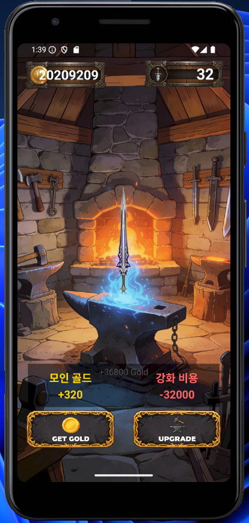

# 🔨 InfiniteForge (Backend)

> **Server-Authoritative Idle RPG Backend (C# ASP.NET Core)**  
> *게임 서버 아키텍처*

## 📖 프로젝트 개요
**InfiniteForge**는 방치형 RPG(Idle RPG)의 핵심 로직을 처리하는 RESTful API 서버입니다.
클라이언트의 조작을 전적으로 신뢰하지 않고, **서버가 시간 차이(Time Delta)와 확률을 검증**하여 재화를 지급하고 장비를 강화하는 **Server-Authoritative(서버 권한)** 구조를 구현했습니다.

본 프로젝트는 **C# ASP.NET Core** 기반의 백엔드 기술 스택을 숙달하고, 빠른 적응 능력 역량을 증명하기 위해 개발되었습니다.

<div align="left">
  
</div>


### 🎯 개발 목표
- **기술 전환:** Node.js/Express 경험을 바탕으로 **ASP.NET Core & C#** 생태계 완벽 적응
- **데이터 무결성:** **Entity Framework Core**의 트랜잭션을 활용한 안전한 강화 시스템 구현
- **확장성 고려:** 추후 DBMS 변경(MySQL ↔ MSSQL)이 용이하도록 ORM 활용

### 🎮 게임 내용
- 유저는 일정 시간(초)마다 골드를 획득합니다. <br />
- 획득한 골드로 무기를 강화할 수 있습니다. <br />
- 무기 레벨이 오를수록 일정 시간(초)마다 획득 가능한 골드는 늘어납니다. <br />
- 무기 레벨이 오를수록 강화 성공 확률은 낮아지고 비용은 비싸집니다. <br />
- 강화 실패 시 재화만 소모됩니다. <br />

---

## 🛠 Tech Stack

### Backend
- **Framework:** .NET 8, ASP.NET Core Web API
- **Language:** C#
- **ORM:** Entity Framework Core (Code-First approach)

### Infrastructure & Database
- **Database:** MySQL 8.0 (Docker)
- **Hosting:** Localhost / Docker Container

### Client (Reference)
- **Framework:** Flutter (flame)

---

## ⚡ 핵심 기능 및 구현 전략 (Key Features)

### 1. 서버 권한 기반의 재화 획득 (Server-Authoritative Economy)
- **문제:** 클라이언트가 `+1000 Gold` 요청을 보내면 메모리 변조 등의 해킹에 취약함.
- **해결:** 클라이언트는 `Collect` 요청만 전송. 서버가 **(현재 시간 - 마지막 획득 시간) × (장비 효율)** 공식을 직접 계산하여 지급.
- **코드 의도:** 신뢰할 수 없는 클라이언트 데이터 검증 및 보안성 강화.

### 2. 원자성이 보장된 강화 시스템 (Transactional Upgrade)
- **문제:** 골드는 차감되었으나, 강화 로직 에러로 레벨이 오르지 않는 불상사 방지.
- **해결:** `IDbContextTransaction`을 사용하여 **[재화 차감 + 확률 계산 + 장비 레벨업 + 상태 업데이트]** 과정을 하나의 트랜잭션으로 묶음.
- **코드 의도:** 트랜잭션(ACID)을 활용한 데이터 정합성 보장 및 논리적 오류 방지.

### 3. ORM을 활용한 생산성 및 유연성 확보
- **MySQL**을 사용해 빠른 개발 환경을 구축했으나, **Entity Framework Core**를 사용하여 비즈니스 로직이 특정 DB(MSSQL 등)에 종속되지 않도록 설계.
- DTO(Data Transfer Object)와 Entity를 분리하여 API 응답 구조 관리.

---

## 📂 API 명세 (Swagger)

서버 실행 시 `/swagger` 경로를 통해 테스트 가능합니다.

| Method | Endpoint | Description |
| :--- | :--- | :--- |
| `POST` | `/api/auth/login` | DeviceID 기반 유저 생성 및 조회 (Idempotent) |
| `POST` | `/api/game/collect` | 시간차(Time Delta) 검증 후 방치 보상 지급 |
| `POST` | `/api/game/upgrade` | 트랜잭션을 적용한 안전한 장비 강화 |

<!-- | `GET` | `/api/user/status` | 유저의 현재 재화 및 장비 상태 조회 | -->
---

## 🚀 Getting Started

### Prerequisites
- .NET 8 SDK
- Docker (for MySQL)

### Installation

1. **Database Setup (Docker)**
   ```bash
   docker run --name infinite-db -e MYSQL_ROOT_PASSWORD=password -p 3306:3306 -d mysql:8.0

<!-- 2. **Database Migration**
   ```bash
   # 프로젝트 루트에서 실행 (EF Core Tool 필요)
   dotnet ef database update -->

2. **Run Server**
   ```bash
   dotnet run

---

## 📝 Retrospective (Node.js → .NET)
- **트랜잭션 관리:** Prisma(Node.js)와 달리 EF Core에서 명시적으로 트랜잭션 스코프를 관리하며 데이터 정합성의 중요성을 체감했습니다.
- **강타입 언어의 장점:** 컴파일 타임에 오류를 잡는 C#의 타입 시스템을 통해 안정적인 서버 개발을 경험했습니다.
- **LINQ 활용:** SQL 쿼리를 객체 지향적으로 작성하는 LINQ의 생산성을 경험했습니다.

---

📞 Contact
Email: minkugu@naver.com